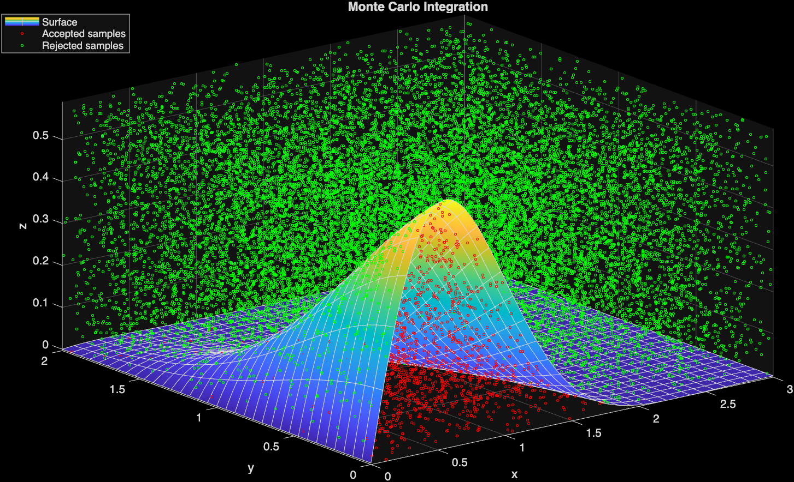
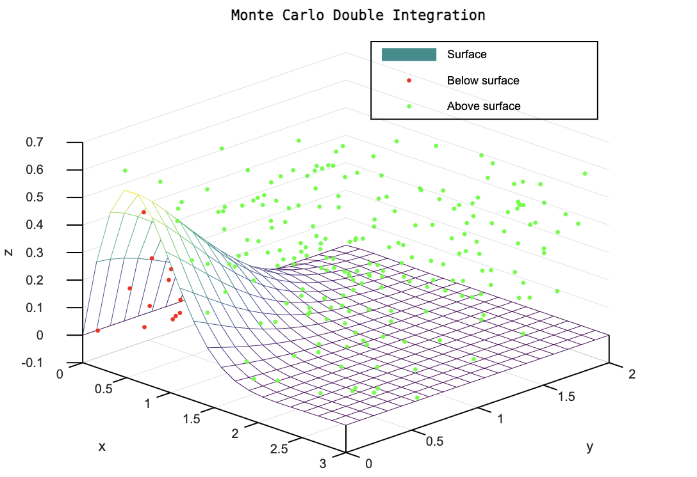
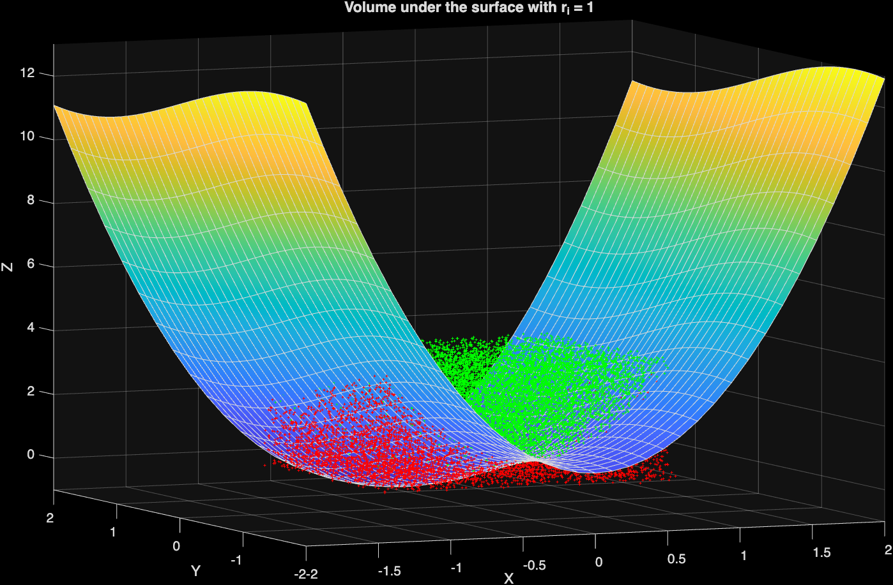

# Monte Carlo Methods

Numerical experiments using **Monte Carlo methods** for estimating double integrals and volumes under surfaces.

The examples in this directory are implemented in **MATLAB** and **GNU Octave** and compare stochastic Monte Carlo approximations with numerical reference solutions.

The main idea is to generate uniformly distributed random samples inside a bounded region and use the fraction of points satisfying a geometric condition to estimate an integral or volume.

---

## Contents

| File                                                                               | Environment | Description                                                         |
| ---------------------------------------------------------------------------------- | ----------- | ------------------------------------------------------------------- |
| [`monte_carlo_double_integral.m`](./monte_carlo_double_integral.m)                 | MATLAB      | Double integral estimation using the Hit-or-Miss Monte Carlo method |
| [`monte_carlo_double_integral_vOctave.m`](./monte_carlo_double_integral_vOctave.m) | GNU Octave  | Octave-compatible version of the double-integral experiment         |
| [`monte_carlo_volume_estimation.m`](./monte_carlo_volume_estimation.m)             | MATLAB      | Volume estimation over outer and inner square regions               |

---

# 1. Monte Carlo Double Integral — MATLAB

**File:** [`monte_carlo_double_integral.m`](./monte_carlo_double_integral.m)

This example estimates the double integral of the surface

$$
f(x,y)=-(x^2-2x)e^{-x^2-y^2-xy}
$$

over the rectangular domain

$$
0\leq x\leq3,
\qquad
0\leq y\leq2.
$$

The script creates a three-dimensional bounding region containing the surface and generates uniformly distributed random points inside it.

A random point is considered a **hit** when

$$
z_i\leq f(x_i,y_i).
$$

The estimated volume is then obtained from

$$
V_{\mathrm{MC}}
=
V_R\frac{N_{\mathrm{hits}}}{N},
$$

where:

* \(V_R\) is the volume of the bounding box,
* \(N\) is the total number of random samples,
* \(N_{\mathrm{hits}}\) is the number of points below the surface.

The Monte Carlo result is compared with MATLAB's numerical `integral2` function.

### Visualization

* **Red points:** accepted samples below the surface.
* **Green points:** rejected samples above the surface.



The accuracy of the approximation generally improves as the number of random samples increases.

---

# 2. Monte Carlo Double Integral — GNU Octave

**File:** [`monte_carlo_double_integral_vOctave.m`](./monte_carlo_double_integral_vOctave.m)

This script implements the same double-integral experiment using **GNU Octave**.

It uses the same function

$$
f(x,y)=-(x^2-2x)e^{-x^2-y^2-xy}
$$

and integration domain

$$
(x,y)\in[0,3]\times[0,2].
$$

The Octave version generates random samples inside a three-dimensional bounding box and classifies them according to their position relative to the surface.

The estimated integral is obtained from the proportion of samples below the surface.

The script also calculates:

* Monte Carlo estimate,
* numerical reference value,
* absolute error,
* relative error.

A fixed random seed is used:

```matlab
rand("seed", 42);
```

which makes the numerical experiment reproducible.

To reduce rendering requirements, particularly when using **Octave Online**, only a subset of the generated Monte Carlo points is displayed.

### Visualization



Although both implementations perform the same numerical experiment, the visualization routines are adapted to the capabilities of MATLAB and GNU Octave.

---

# 3. Monte Carlo Volume Estimation

**File:** [`monte_carlo_volume_estimation.m`](./monte_carlo_volume_estimation.m)

This experiment applies the **Hit-or-Miss Monte Carlo method** to the surface

$$
f(x,y)=3x^2-\sin(y).
$$

Two integration regions are analyzed.

## Outer region

$$
(x,y)\in[-2,2]\times[-2,2]
$$

For this region, \(20\,000\) uniformly distributed random samples are generated inside a bounding rectangular prism.

The Monte Carlo estimate is calculated as

$$
V_{\mathrm{outer}}
\approx
V_R
\frac{N_{\mathrm{hits}}}{N}.
$$

The result is compared with

```matlab
integral2(f,-2,2,-2,2)
```

to determine the absolute approximation error.

## Inner region

The experiment is then repeated over

$$
(x,y)\in[-1,1]\times[-1,1].
$$

The same Monte Carlo procedure is used to estimate the corresponding volume.

Finally, the script calculates

$$
V_{\mathrm{approx}}
=
V_{\mathrm{outer}}
-
V_{\mathrm{inner}}.
$$

### Visualization

The generated points make the Hit-or-Miss procedure visible:

* **Red points:** samples satisfying \(z\leq f(x,y)\).
* **Green points:** samples that do not satisfy the condition.



This visualization illustrates how the ratio between successful samples and the total number of generated samples can be used to approximate a volume.

---

# Monte Carlo Method

Monte Carlo integration approximates numerical quantities using random sampling.

For a Hit-or-Miss experiment, if random points are generated uniformly inside a known bounding volume \(V_R\), the unknown volume can be approximated by

$$
V
\approx
V_R
\frac{N_c}{N},
$$

where

$$
N_c
=
\text{number of points satisfying the acceptance condition}
$$

and

$$
N
=
\text{total number of generated points}.
$$

Therefore,

$$
\frac{N_c}{N}
$$

approximates the fraction of the bounding region occupied by the volume of interest.

Because Monte Carlo methods are stochastic, running the program multiple times can produce slightly different estimates.

---

# Requirements

## MATLAB

The MATLAB examples use functions including:

```matlab
rand
integral2
fsurf
plot3
meshgrid
```

Run a script directly from MATLAB, for example:

```matlab
monte_carlo_double_integral
```

or

```matlab
monte_carlo_volume_estimation
```

---

## GNU Octave

The Octave implementation can be executed with:

```bash
octave monte_carlo_double_integral_vOctave.m
```

or opened directly in GNU Octave / Octave Online.

---

# Repository Structure

```text
monte-carlo/
│
├── monte_carlo_double_integral.m
├── monte_carlo_double_integral_vOctave.m
├── monte_carlo_volume_estimation.m
│
├── montecarloIntegration_1.png
├── montecarlo_volume_estimation.png
│
└── README.md
```

---

# Numerical Experiment

Monte Carlo methods rely on the Law of Large Numbers: as the number of samples increases, the statistical estimate tends to approach the expected value.

For example, increasing

```matlab
numSamples = 10000;
```

or

```matlab
n = 20000;
```

generally reduces the statistical variation of the approximation, although it also increases computation time.

This makes these examples useful for visualizing the relationship between:

$$
\text{random sampling}
\quad\longrightarrow\quad
\text{probability}
\quad\longrightarrow\quad
\text{numerical integration}.
$$

---

Numerical methods, mathematical modeling, simulation, and computational experiments using MATLAB and GNU Octave.
